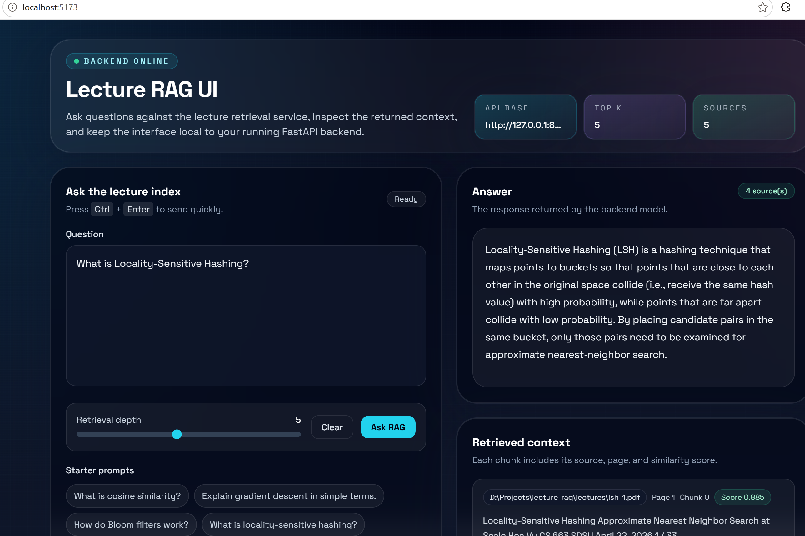

# Lectures RAG

A lightweight retrieval-augmented generation project for lecture PDFs.

## What This Project Includes

- PDF parsing and token-aware chunking
- Shared YAML config in `config.yaml`
- FastEmbed embeddings
- Qdrant-backed retrieval for lecture chunks
- PostgreSQL storage for chunk text inspection in pgAdmin
- FastAPI RAG service
- Groq chat completion via the Groq SDK

## Project Files

- `processing/chunkpdf.py`: Parses PDFs from `lectures/`, generates `lectures_chunks.jsonl`, and persists chunks to Postgres and Qdrant.
- `processing/postgres_store.py`: PostgreSQL persistence for parsed lecture chunks.
- `processing/qdrant_store.py`: Qdrant upsert helper used by the processing pipeline.
- `rag-service/`: FastAPI RAG service that exposes `/`, `/health`, and `/ask`.

## UI Preview



## Prerequisites

- Python 3.10+
- PostgreSQL 15+ if you want to inspect chunk text in pgAdmin
- Qdrant running locally or remotely
- Groq API key configured in `config.yaml`

## Install

From the project root:

```bash
python -m venv .venv
source .venv/bin/activate  # or .\.venv\Scripts\activate on Windows
pip install --upgrade pip
pip install -r requirements.txt
```

If you only need one half of the project:

```bash
pip install -r rag-service/requirements-backend.txt
pip install -r processing/requirements-processing.txt
```

## Configuration

Edit `config.yaml` in the project root to change model, chunking, database, and retrieval settings.

Key settings:
- `chunk_max_tokens`: maximum tokens per chunk. Lower values create smaller chunks and can help keep prompts smaller.
- `chunk_overlap_tokens`: overlap between adjacent chunks. Lower values reduce duplicate context.
- `default_top_k`: number of chunks retrieved per question. Lower values reduce prompt size.
- `minimum_relevance_score`: score cutoff used by the RAG service. If the best match is below this value, the answer is `I don't know.`

## End-to-End Workflow

### 1) Put lecture PDFs in `lectures/`

Place PDFs in:

```text
./lectures/*.pdf
```

### 2) Chunk PDFs and index them

Run the processing pipeline from the project root:

```bash
python processing/chunkpdf.py
```

This script writes `lectures_chunks.jsonl` and, when `database_url` is set in `config.yaml`, inserts rows into PostgreSQL and upserts vectors into Qdrant.

If you change `chunk_max_tokens` or `chunk_overlap_tokens`, re-run this step so the stored chunks are regenerated.

### 3) Start the RAG service

Run the FastAPI app from `rag-service/`:

```bash
cd rag-service
uvicorn app.main:app --reload
```

Open `http://127.0.0.1:8000/docs` for the interactive API docs.

### 4) Query the service

Send questions to `/ask`. The service answers only from retrieved lecture context and returns `I don't know.` when the question is not relevant enough.

## Troubleshooting

- PostgreSQL table is empty
  - Verify `database_url` in `config.yaml`.
  - Re-run `python processing/chunkpdf.py`.

- Model or prompt is too large
  - Lower `chunk_max_tokens`, `chunk_overlap_tokens`, or `default_top_k`.
  - The RAG service also truncates retrieved text before sending it to Groq.

- Question is unrelated to the lectures
  - Increase `minimum_relevance_score` if you want stricter filtering.
  - Decrease it if the service is rejecting too many valid questions.

- Qdrant errors
  - Verify `qdrant_url` in `config.yaml` points to a running Qdrant instance.

## Notes

- The processing pipeline uses the configured embedding model tokenizer when available.
- Ingestion endpoints were removed from the RAG API so the service stays focused on answering questions.
